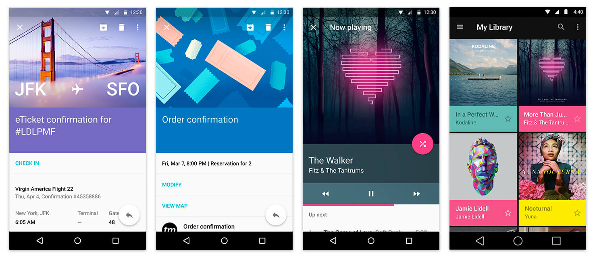
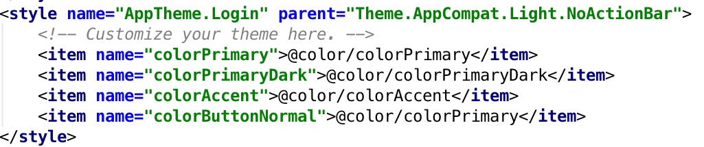
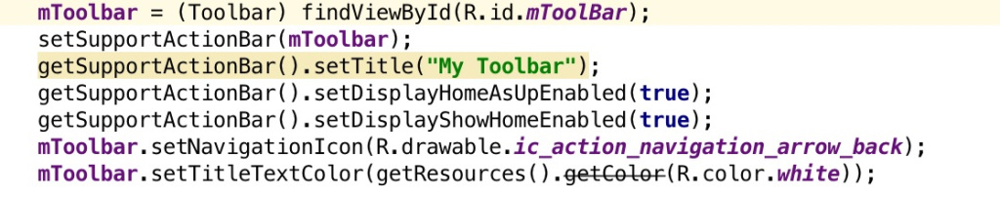
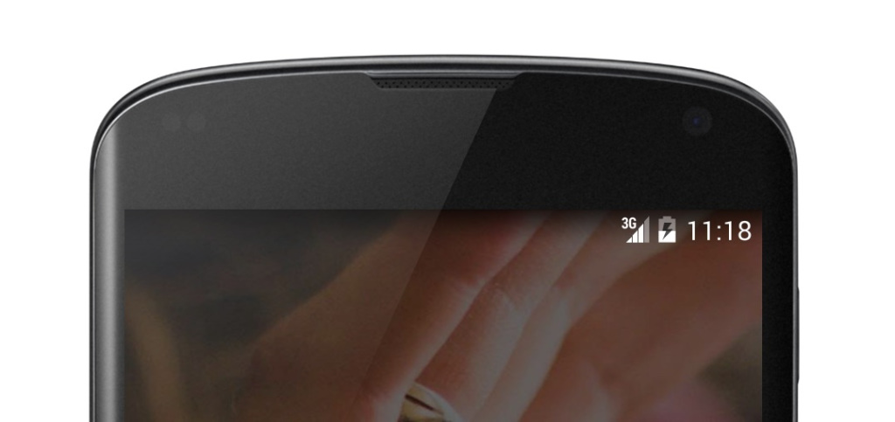

# Statusbar

- Từ phiên bản Android KitKat (4.4), Google đã cho phép chúng tôi hỗ trợ status bar transparent, tuyệt vời nhất từng được tìm kiếm trong nhiều năm trong SDK chính thức.

- Và bây giờ trong theme material mới của Lollipop với một số control UI và kết hợp màu sắc đẹp mắt, chúng tôi thực sự có thể tận dụng tối đa tính năng thú vị đó.

- Status bar transparent này thường được sử dụng với navigation drawer dường như bên dưới status bar. Ngoài ra đối vovới hình ảnh trên đầu và bố trí điều phối viên, statusbar transparent giờ đây đã trở thành một công cụ UI tiêu chuẩn.

- Ở đây tôi sẽ trình bày cách bạn có thể thực hiện giao diện tương tự trong ứng dụng của mình cho các thiết bị chạy phiên bản Android 4.4 trở lên.

- Trước hết, vì status bar này chỉ được hỗ trợ trong phiên bản 4.4 trở lên, chúng ta cần tạo một thư mục value-v19 .

- Vì vậy, tạo một thư mục mới trong thư mục res của bạn dưới dạng value-v19.

- Trong value-V19 , sao chép giá trị bình thường của bạn styles.xml mà là có theme của bạn trong đó.

normal_style.jpg

- Theme ở trên này sẽ nằm trong tệp style.xml . Ở đây, NoActionBar có nghĩa là bạn sẽ không có tiêu đề trong hoạt động của mình. Vui lòng sử dụng tpppnar và sau đó đặt nó làm actionbar của activity.

- Điều này sẽ đặt toolbar như một actionbar. Bây giờ, đến điểm chính của chúng tôi là làm thế nào chúng ta có thể đặt thanh trạng thái mờ trên thanh công cụ.

- Tôi hy vọng bạn đã sao chép thư mục giá trị thông thường style.xml trong thư mục mới value-v19. 

- Trong này styles.xml mà bạn đã sao chép trong các giá trị-V19 , xác định các chủ đề như sau:

transculent_statusbar.jpg

- Ở đây, trong đoạn trích trên, -> android:windowTranslucentStatus -> làm status bar transparent

- Trong bố trí activity vùng chứa của bạn, đừng quên đặt fitSystemWindow =, đúng true, cho bố cục chính và cho toobar và các chế độ xem nội bộ khác mà bạn muốn UI phù hợp với cửa sổ hệ thống. Đó là một cách sử dụng khá phổ biến cho activity với coordinator layout.

- Sau khi áp dụng các thay đổi ở trên, cuối cùng bạn sẽ có được bố cục như bên dưới:

- Để áp dụng điều tương tự cho Lollipop, chỉ cần sao chép thư mục của value-v19 và dán vào giá trị-v21 trong đó bạn cũng có thể thực hiện một số thay đổi cụ thể cho phiên bản Lollipop .

- Điều cuối cùng là đừng quên thiết lập chủ đề này trong hoạt động của bạn mà bạn muốn đặt hiệu ứng tuyệt vời này của thanh trạng thái trong suốt.

### StatusBar vs DrawerLayout

        <?xml version="1.0" encoding="utf-8"?>
        <android.support.v4.widget.DrawerLayout xmlns:android="http://schemas.android.com/apk/res/android"
            xmlns:app="http://schemas.android.com/apk/res-auto"
            xmlns:tools="http://schemas.android.com/tools"
            android:id="@+id/drawer_layout"
            android:layout_width="match_parent"
            android:layout_height="match_parent"
            android:fitsSystemWindows="true"
            tools:openDrawer="start">

            <include
                layout="@layout/app_bar_main"
                android:layout_width="match_parent"
                android:layout_height="match_parent" />

            <android.support.design.widget.NavigationView
                android:id="@+id/nav_view"
                android:layout_width="wrap_content"
                android:layout_height="match_parent"
                android:layout_gravity="start"
                android:fitsSystemWindows="true"
                app:headerLayout="@layout/nav_header_main"
                app:menu="@menu/activity_main_drawer" />

        </android.support.v4.widget.DrawerLayout>

CoordinatorLayout xml

        <?xml version="1.0" encoding="utf-8"?>

        <android.support.design.widget.CoordinatorLayout
            xmlns:android="http://schemas.android.com/apk/res/android"
            xmlns:app="http://schemas.android.com/apk/res-auto"
            android:layout_width="match_parent"
            android:layout_height="match_parent"
            android:background="@android:color/background_light"
            android:fitsSystemWindows="true"
            >

            <android.support.design.widget.AppBarLayout
                android:id="@+id/main.appbar"
                android:layout_width="match_parent"
                android:layout_height="300dp"
                android:theme="@style/AppTheme.AppBarOverlay"
                android:fitsSystemWindows="true"
                >

                <android.support.design.widget.CollapsingToolbarLayout
                    android:id="@+id/main.collapsing"
                    android:layout_width="match_parent"
                    android:layout_height="match_parent"
                    app:layout_scrollFlags="scroll|exitUntilCollapsed"
                    android:fitsSystemWindows="true"
                    app:contentScrim="?attr/colorPrimary"
                    app:expandedTitleMarginStart="48dp"
                    app:expandedTitleMarginEnd="64dp"
                    >

                    <ImageView
                        android:id="@+id/main.backdrop"
                        android:layout_width="match_parent"
                        android:layout_height="match_parent"
                        android:scaleType="centerCrop"
                        android:fitsSystemWindows="true"
                        android:src="@drawable/material_flat"
                        app:layout_collapseMode="parallax"
                        />

                    <android.support.v7.widget.Toolbar
                        android:id="@+id/main.toolbar"
                        android:layout_width="match_parent"
                        android:layout_height="?attr/actionBarSize"
                        app:layout_collapseMode="pin"
                        />
                </android.support.design.widget.CollapsingToolbarLayout>
            </android.support.design.widget.AppBarLayout>

            <android.support.v4.widget.NestedScrollView
                android:layout_width="match_parent"
                android:layout_height="match_parent"
                app:layout_behavior="@string/appbar_scrolling_view_behavior"
                >

                <LinearLayout
                    android:orientation="vertical"
                    android:layout_width="wrap_content"
                    android:layout_height="wrap_content">
                    <TextView
                        android:layout_width="match_parent"
                        android:layout_height="wrap_content"
                        android:textSize="20sp"
                        android:lineSpacingExtra="8dp"
                        android:text="@string/lorem"
                        android:padding="@dimen/activity_horizontal_margin"
                        />

                    <include layout="@layout/content_main" />
                </LinearLayout>

            </android.support.v4.widget.NestedScrollView>

            <android.support.design.widget.FloatingActionButton
                android:layout_height="wrap_content"
                android:layout_width="wrap_content"
                android:layout_margin="@dimen/activity_horizontal_margin"
                android:src="@drawable/ic_comment_black_24dp"
                app:layout_anchor="@id/main.appbar"
                app:layout_anchorGravity="bottom|right|end"
                />
        </android.support.design.widget.CoordinatorLayout>

style.xml 

          <resources>

              <!-- Base application theme. -->
              

              

              <style name="AppTheme.PopupOverlay" parent="ThemeOverlay.AppCompat.Light" />
              <style name="AppTheme.AppBarOverlay" parent="ThemeOverlay.AppCompat.Dark.ActionBar" />
          </resources>
          
### Status bar below kitkat

- Sử dụng reflection

                int ResolveTransparentStatusBarFlag()
                        {
                            String[] libs = getPackageManager().getSystemSharedLibraryNames();
                            String reflect = null;

                            if (libs == null)
                                return 0;

                            for (String lib : libs)
                            {
                                if (lib.equals("touchwiz"))
                                    reflect = "SYSTEM_UI_FLAG_TRANSPARENT_BACKGROUND";
                                else if (lib.startsWith("com.sonyericsson.navigationbar"))
                                    reflect = "SYSTEM_UI_FLAG_TRANSPARENT";
                            }

                            if (reflect == null)
                                return 0;

                            try
                            {
                                Field field = View.class.getField(reflect);
                                if (field.getType() == Integer.TYPE)
                                    return field.getInt(null);
                            }
                            catch (Exception e)
                            {
                            }

                            return 0;
                        }
   
                        void ApplyTransparentStatusBar()
                        {
                            Window window = getWindow();
                            if (window != null)
                            {
                                View decor = window.getDecorView();
                                if (decor != null)
                                    decor.setSystemUiVisibility(ResolveTransparentStatusBarFlag());
                            }
                        }
